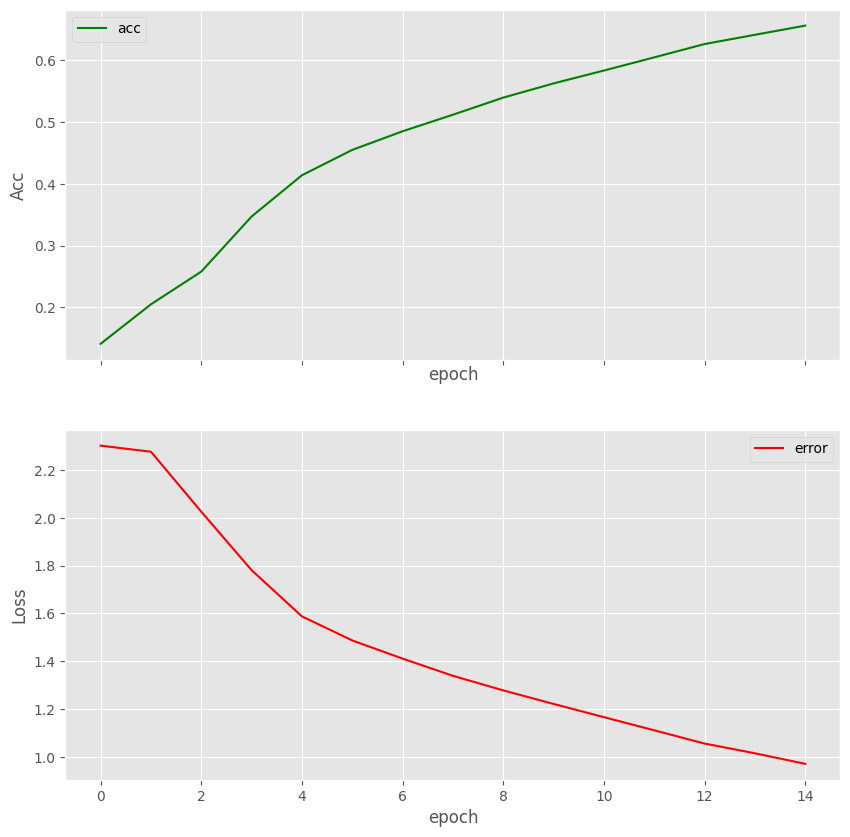

# CIFAR-10 Classification with PyTorch

A **Convolutional Neural Network (CNN)** built using **PyTorch** to classify images from the **CIFAR-10** dataset.

---

## 📌 Overview
This project implements a CNN to learn and predict the **CIFAR-10** dataset. The model supports both **CPU** and **GPU** training.

---

## 🛠️ Libraries Used
```python
import torch
import torchvision
import torch.nn as nn
import torch.nn.functional as F
import torch.optim as optim
import torchvision.transforms as transforms
import matplotlib.pyplot as plt
import numpy as np
import cv2
from tqdm import tqdm
```

---

## 🖥️ Hardware Support
The model automatically detects and uses **GPU** if available:
```python
if torch.cuda.is_available():
    print('Run on GPU')
    device = torch.device("cuda:0")
else:
    print('Run on CPU')
    device = torch.device("cpu")
```

---

## 📊 Model Architecture
The CNN architecture consists of:
- **3 Convolutional Layers**:
  - `Conv2d(3, 32, kernel_size=3, stride=1, padding=1)`
  - `Conv2d(32, 64, kernel_size=3, stride=1, padding=1)`
  - `Conv2d(64, 128, kernel_size=3, stride=1, padding=1)`
- **3 Fully Connected Layers**:
  - `Linear(in_features=2048, out_features=120)`
  - `Linear(in_features=120, out_features=84)`
  - `Linear(in_features=84, out_features=10)`

---

## 📈 Training and Evaluation
- The program downloads the **CIFAR-10** dataset and splits it into **trainset** and **testset**.
- **Training History**:
  

- **Test Performance**:
  - **Test Accuracy**: 0.66
  - **Test Loss**: 0.9756

---

## 📚 Dataset Reference
[1] [CIFAR-10 Dataset](https://www.cs.toronto.edu/~kriz/cifar.html)
